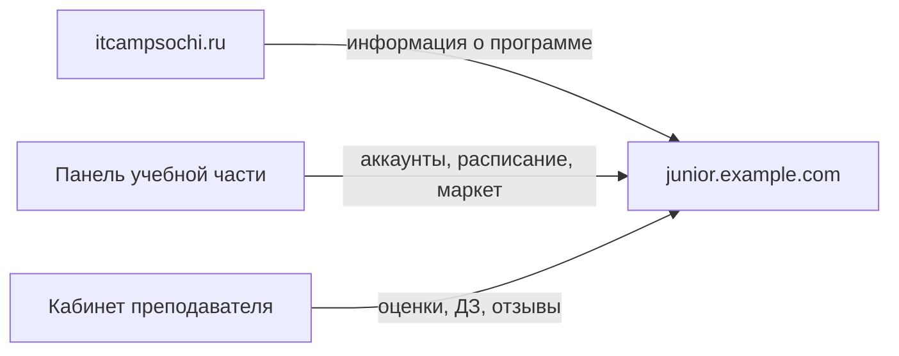

# Контекст: IT Camp Sochi

## Школа

**IT Camp Sochi** ([itcampsochi.ru](https://itcampsochi.ru/)) — дополнительное образование для детей в Сочи. В интерфейсе дневника бренд сайдбара: **IT CAMP** / **Гимназия №16** (площадка филиала).

| | |
| --- | --- |
| Организация | ООО «ИТ СОЧИ» |
| Программа | Дополнительная общеобразовательная программа **«IT-старт»** |
| Направленность | Техническая, стартовый (ознакомительный) уровень |
| Город | Сочи (единственный филиал) |
| Телефон | [8 (953) 111-10-57](tel:+79531111057) |
| Почта | [c4mp.it@yandex.ru](mailto:c4mp.it@yandex.ru) |

## Аудитория дневника

Электронный дневник рассчитан на **детей 7–14 лет**. Родитель пользуется **тем же аккаунтом** — отдельного «родительского кабинета» нет.

В программе две возрастные группы:

| Группа | Возраст | Занятия |
| --- | --- | --- |
| Младшая | 7–8 лет | 1 раз в неделю, 2 академических часа (80 мин), 68 часов в год |
| Старшая | 9–14 лет | 1 раз в неделю, 4 академических часа, 136 часов в год |

Учебный год: сентябрь — май (36 учебных недель). Промежуточная аттестация — декабрь и май.

## Предметы в программе

Предметы в дневнике соответствуют модулям программы «IT-старт». Обложки и цвета предметов задаёт учебная часть.

### Группа 9–14 лет

| Предмет | Сокращение |
| --- | --- |
| Старт в IT | StartIT |
| 3D-моделирование и VR | 3DM&VR |
| Робототехника (LEGO) | LEGO |
| Разработка игр: KODU | Kodu |
| Игровой дизайн (GIMP) | GD5 |
| Разработка игр Junior (Construct 3) | Construct3 |

### Группа 7–8 лет

| Предмет |
| --- |
| IT Старт |
| Моделирование 3D мира |
| Медиа и блогинг |
| Программирование на Scratch |
| Мультипликация |
| Робототехника (LEGO WeDo) |

## Место в экосистеме

- **itcampsochi.ru** — публичный сайт: программа, лицензия, контакты.
- **junior.example.com** — личный кабинет студента (этот проект).
- Данные создают и редактируют **учебная часть** и **преподаватели**; студент сдаёт работы, смотрит расписание и тратит монетки.

## Что студент делает в школе vs в дневнике

| В школе (офлайн/онлайн) | В дневнике |
| --- | --- |
| Посещает занятия | Видит расписание, посещаемость, оценки |
| Выполняет задания на уроке | — |
| Получает домашнее задание от преподавателя | Скачивает и загружает файлы |
| Сдаёт экзамены/контрольные | Загружает работы, видит оценку |
| Получает товар из маркета | Покупает за монетки, забирает в школе |
| Родитель оплачивает обучение | Смотрит реквизиты, график и историю платежей |
